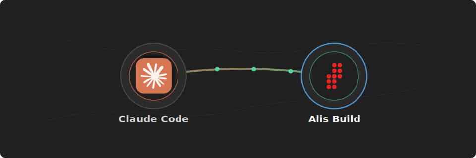

# Alis Build Claude Code Plugin

<p align="center">
  
</p>

<p align="center">
  <strong>Connect Claude Code to Alis Build.</strong>
</p>

Use this plugin to let Claude Code inspect Alis Build landing zones, products, neurons, builds, deploys, and related workspace context.

## What You Get

- A preconfigured Claude Code MCP server for `https://mcp.alis.build`
- OAuth/OIDC sign-in through `https://identity.alisx.com`
- Alis Build tools available inside Claude Code after sign-in
- Claude Code approval prompts before tools perform sensitive actions

## Before You Start

You need:

- Claude Code installed and authenticated
- An Alis Build account with access to the landing zones and products you want to use
- Network access to `https://mcp.alis.build` and `https://identity.alisx.com`

## Install

Add the Alis plugin marketplace:

```sh
claude plugin marketplace add alis-build/claude-plugin --sparse .claude-plugin plugins/alis-build
```

Install the Alis Build plugin:

```sh
claude plugin install alis-build@alis --scope user
```

Start Claude Code:

```sh
claude
```

For a repository-shared install, use project scope:

```sh
claude plugin install alis-build@alis --scope project
```

## Sign In

In Claude Code, run:

```text
/mcp
```

Select the `api` MCP server for the `alis-build` plugin and complete the OAuth sign-in flow in your browser.

You should see `api` listed as a plugin-provided MCP server for `alis-build`. The sign-in flow opens `https://identity.alisx.com` in your browser.

## Use It

After sign-in, ask Claude Code to use Alis Build:

```text
Use Alis Build to list the landing zones I can access.
```

```text
Show recent builds for product os in landing zone alis.
```

```text
Review the latest deploy logs for this neuron and suggest the next action.
```

Claude Code will ask before running tools that require approval.

## Troubleshooting

If `api` does not appear in `/mcp`, confirm that the plugin install completed successfully:

```sh
claude plugin install alis-build@alis --scope user
```

If you installed or changed the plugin inside an already-running Claude Code session, reload plugins:

```text
/reload-plugins
```

If sign-in fails, confirm that you can reach both `https://mcp.alis.build` and `https://identity.alisx.com`, then try `/mcp` again.
