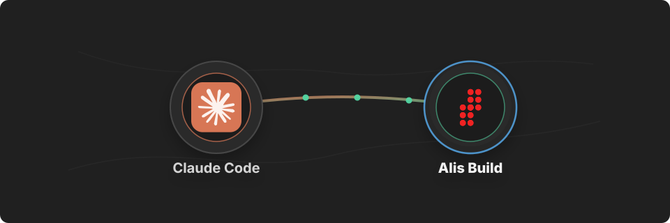

# Alis Build Claude Code Plugin

<p align="center">
  
</p>

<p align="center">
  <strong>Connect Claude Code to Alis Build.</strong>
</p>

Use this plugin to let Claude Code work with Alis Build organisations, products, neurons, builds, and deploys through the `alis` CLI, with workspace-aware context injected into every session.

## What You Get

- A standing Define → Build → Deploy primer loaded into every session, so Claude knows the workflow, how to route requests, and to run the `alis` CLI — no trigger word required
- When a session opens inside a `~/alis.build/<org>/build|define/…` service folder, the package id and a pointer to its definitions ⇄ implementation counterpart are injected automatically
- Plugin-owned discovery and capture skills, with catalog metadata refreshed quietly at session start; the plugin never installs or prunes native user skills
- A one-time `/alis-build:connect-google` command that connects Google's official Developer Knowledge MCP server (docs search over cloud.google.com, Android, Flutter, Firebase, go.dev, web.dev, …)
- The `alis` CLI auto-approved in Claude Code, so command-line calls run without a permission prompt each time

## Before You Start

You need:

- Claude Code installed and authenticated
- The [`alis` CLI](https://alis.build) installed, on your `PATH`, and signed in (`alis login`)
- An Alis Build account with access to the organisations and products you want to use

## Install

Add the Alis plugin marketplace:

```sh
claude plugin marketplace add https://github.com/alis-build/claude-plugin --sparse .claude-plugin plugins/alis-build
```

Install the Alis Build plugin:

```sh
claude plugin install alis-build@alis --scope user
```

Start Claude Code:

```sh
claude
```

For a repository-shared install, use project scope:

```sh
claude plugin install alis-build@alis --scope project
```

## Use It

Ask Claude Code to use Alis Build:

```text
build it
```

```text
fix it
```

```text
Use Alis Build to list the organisations I can access.
```

```text
Show recent builds for product os in organisation alis.
```

```text
Review the latest deploy logs for this neuron and suggest the next action.
```

Claude Code will ask before running tools that require approval.

The plugin auto-approves single, simple `alis ...` shell commands so the CLI runs without a permission prompt each time. For safety it only approves a lone invocation — anything that chains or redirects (`|`, `&&`, `||`, `;`, `&`, `>`, `<`, backticks, `$(...)`) falls through to Claude Code's normal permission flow. To restrict which subcommands are auto-approved, set `ALIS_ALLOWED_SUBCMDS` to a space-separated allowlist (e.g. `ALIS_ALLOWED_SUBCMDS="define build deploy operations"`); unset means every `alis` subcommand is approved.

## Commands

This plugin includes Alis Build workflow commands:

```text
/alis-build:build-it
/alis-build:fix-it
/alis-build:connect-google
```

Type `build it` to discover the right Alis Build skill for the thing you want to build. Type `fix it` to use the same discovery flow when the goal is framed as a fix. `/alis-build:build-it` and `/alis-build:fix-it` are slash-command shortcuts for the same router. `/alis-build:connect-google` is a one-time setup command for the Google Developer Knowledge MCP server (see below). If you installed or changed the plugin inside an already-running Claude Code session, run `/reload-plugins`.

## Google Developer Knowledge MCP (optional)

Google's official documentation-search MCP server ([developers.google.com/knowledge/mcp](https://developers.google.com/knowledge/mcp)) gives Claude the `search_documents`, `get_documents`, and `answer_query` tools over Google's own docs index — cloud.google.com, developer.android.com, Flutter, Firebase, go.dev, web.dev, and more. Alis Build services run on Google Cloud, so this covers most platform-infrastructure questions with current, canonical pages instead of web search.

To set it up, run this once in Claude Code and complete the Google sign-in in your browser:

```text
/alis-build:connect-google
```

The command adds the server at user scope using the plugin's shared Google OAuth Desktop-app client. The client secret is stored in your OS keychain by Claude Code — it never lands in a config file. Restart the session (or open `/mcp`) afterwards to pick up the new tools.

Already have this MCP server installed? Nothing breaks: the command detects any existing server pointing at `developerknowledge.googleapis.com` (under any name, at any scope) and leaves it alone, and Claude Code itself deduplicates MCP servers by endpoint URL — your own configuration always wins.

Notes while the OAuth consent screen is in Testing mode:

- Your Google account must be registered as a test user by the plugin maintainer. An "access blocked / app not verified" error during sign-in means it is not.
- Sign-in expires after about 7 days; re-run `claude mcp login google-developer-knowledge` (or use `/mcp`) to re-authenticate.

At session start the plugin checks whether the server is connected and, if not, quietly reminds Claude to suggest `/alis-build:connect-google` when Google documentation comes up. Set `ALIS_SUPPRESS_GOOGLE_MCP_NUDGE=1` to silence this.

### Maintainer: Google OAuth client setup

One-time setup for the credentials shipped in `plugins/alis-build/commands/connect-google.md`:

1. Create (or choose) a Google Cloud project and enable the **Developer Knowledge API**. Quota for all plugin users is billed against this project.
2. Configure the OAuth consent screen: External, Testing mode, and add each team member's Google account as a test user.
3. Create an OAuth client of type **Desktop app** and copy its client id and secret.
4. Replace `__GOOGLE_OAUTH_CLIENT_ID__` and `__GOOGLE_OAUTH_CLIENT_SECRET__` in `plugins/alis-build/commands/connect-google.md`.

Per [Google's installed-app OAuth model](https://developers.google.com/identity/protocols/oauth2#installed) the Desktop-app client secret is not treated as confidential, so committing it is acceptable — but GitHub secret scanning will likely flag the `GOCSPX-…` value on a public repository (dismiss or allowlist the alert). Publishing the consent screen to Production later removes the 7-day sign-in expiry and the test-user list (Google verification may be required for the scope).

## Troubleshooting

If the primer or commands do not appear, confirm that the plugin install completed successfully:

```sh
claude plugin install alis-build@alis --scope user
```

If you installed or changed the plugin inside an already-running Claude Code session, reload plugins:

```text
/reload-plugins
```

If `alis` commands fail with an auth error, run `alis login` (or `alis authorise <org>.<product>` for git/package credentials) and retry.
