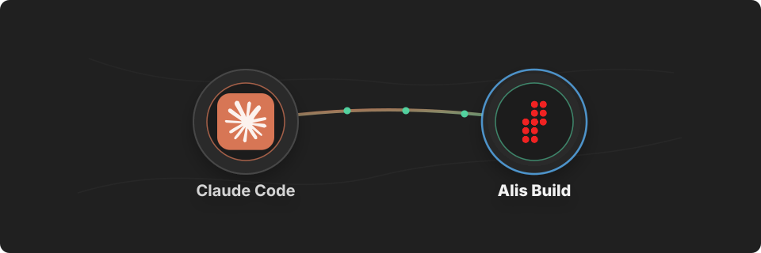

# Alis Build Claude Code Plugin

<p align="center">
  
</p>

<p align="center">
  <strong>Connect Claude Code to Alis Build.</strong>
</p>

Use this plugin to let Claude Code work with Alis Build organisations, products, neurons, builds, and deploys through the `alis` CLI, with workspace-aware context injected into every session.

## What You Get

- A standing Define → Build → Deploy primer, so Claude knows the workflow, how to route requests, and to run the `alis` CLI — no trigger word required. The full primer loads inside `~/alis.build` workspaces; other directories get a compressed digest when the `alis` CLI is installed, and nothing otherwise (override with `ALIS_PRIMER=full|digest|off`)
- When a session opens inside a `~/alis.build/<org>/build|define/…` service folder, the package id and a pointer to its definitions ⇄ implementation counterpart are injected automatically
- Quiet, local-first discovery and capture skills: `alis:discover` fires on platform-shaped work (never on generic coding just because you are inside a workspace), probes the local catalog in ~40ms, and loads a registry skill only on a distinctive match; catalog metadata is refreshed quietly at session start and the plugin never installs or prunes native user skills
- Wake phrases (`alis, …`, `capture this as a skill`) route to `alis:discover` or `alis:capture` from any directory (a `UserPromptSubmit` hook backed by `alis skills suggest --hook`); the CLI's unsolicited per-prompt skill suggestions are dropped, because matching whole prompts suggested unrelated skills too often
- Structured CLI workflows run with the CLI's automation tier; guarded actions use Claude's native confirmation
- Function hooks (Claude Code mods): on Claude Code 2.1.287 or later, where Claude Code has the feature switched on, the permission gate, handoff lifecycle and wake-phrase routing run inside Claude Code's plugin engine instead of shell scripts, and `/alis status`, `/alis ops` and `/alis handoff [alias]` are available; elsewhere the shell hooks run exactly as before
- A live row under every build and deploy Claude runs or waits on (in the foreground or the background): what is happening, a progress bar, the step and what comes next, folding to one outcome line ("✓ 2.44.19 is live on Development · 4m 09s · Logs") when it ends. Each row starts with the Alis mark: the brand SVG on desktop, a one-cell picture in Ghostty and kitty, the name elsewhere

## Before You Start

You need:

- Claude Code v2.1.211 or later, installed and authenticated (v2.1.287 or later, with the feature switched on, for the function hooks)
- Bash, `jq`, and Python 3.9 or later available on `PATH`
- The [`alis` CLI](https://alis.build) installed, on your `PATH`, and signed in (`alis login`)
- An Alis Build account with access to the organisations and products you want to use

## Install

Add the Alis plugin marketplace:

```sh
claude plugin marketplace add https://github.com/alis-build/claude-plugin --sparse .claude-plugin plugins/alis-build
```

Install the Alis Build plugin:

```sh
claude plugin install alis@alis --scope user
```

Start Claude Code:

```sh
claude
```

For a repository-shared install, use project scope:

```sh
claude plugin install alis@alis --scope project
```

### Upgrading from `alis-build`

Releases before v0.24.0 were published as the `alis-build` plugin
(`/alis-build:…` commands). The plugin is now named `alis`, so the two are
separate installs: remove the old one before installing the new one, or Claude
loads both.

```sh
claude plugin marketplace update alis
claude plugin uninstall alis-build@alis
claude plugin install alis@alis --scope user
```

A project-scoped install is flipped by replacing `alis-build@alis` with
`alis@alis` under `enabledPlugins` in `.claude/settings.json`. The `alis` CLI's
setup and updates flows run this migration for you.

## Use It

Ask Claude Code to use Alis Build:

```text
build it
```

```text
fix it
```

```text
Use Alis Build to list the organisations I can access.
```

```text
Show recent builds for product os in organisation alis.
```

```text
Review the latest deploy logs for this neuron and suggest the next action.
```

Claude Code will ask before running tools that require approval.

Use one standalone `alis` command per Bash call. The plugin allows known read commands and structured Define/Build/Deploy/package workflows; the CLI's automation tier and production gate still apply. Arbitrary process runners, unknown commands and messaging verbs retain Claude's normal permission handling. Pipes, redirects and shell composition receive execution guidance and no automatic allow.

Use `alis --cwd /absolute/workspace/path ...` for another workspace, and `alis environment list <org>.<product> --json` to choose a target without fetching variable values. These require the CLI release containing the Claude reliability changes; check `alis --help` and `alis environment --help`. New logs/cancellation commands also need the matching backend.

Guarded actions (`--confirm-production`, `--approve`, `--yes`, block uninstall, environment unset, and the secret-printing `environment variables|vars|refresh` and `--reveal`) request native confirmation of the exact command. When needed, the hook includes `--approve` in the command shown for confirmation so the CLI does not ask a second time; it never inserts `--confirm-production`. Plan mode cannot run these actions. Higher-priority Claude rules/classifier denials remain in force. Session attribution uses a per-command `--session-id`; no shared approval file is written or trusted for Claude. `auto` and `acceptEdits` are not consent to external actions.

After every tool call the plugin looks for secret-looking values in the result and in the call's own arguments (Stripe, GitHub, npm, PyPI, Linear, SendGrid, AWS, Google and Slack keys, connection strings with passwords, private keys, `NAME=value` lines whose upper-case name says secret, and every row an `alis environment … --reveal` printed). With the function hooks (Claude Code 2.1.287 or later), a tool result is masked before Claude reads it: each value becomes `[REDACTED:kind]`, its name kept (`DB_PASSWORD=[REDACTED:assignment]`), and a toast names the kinds. The value never goes to the model, but the session's transcript file on your machine still holds the raw output, because Claude Code stores a structured copy of each tool result that hooks cannot rewrite. Two things cannot be masked and get a warning instead: the values in a call's own arguments, and what an approved `alis environment … --reveal` printed, which reaches Claude as you asked. A warned-about value cannot be unprinted, so the plugin shows which kinds landed and that they need rotating, and tells the model not to repeat them. Without the function hooks, every hit gets that warning. Values never appear in a toast or warning, and each value is reported once per session. The CLI masks its own uploads and `environment variables` output since 1.146.1; this covers `cat .env`, `printenv`, a written `.env` and the like.

`ALIS_ALLOWED_SUBCMDS` restricts automatic allows (for example `context doctor operations`); it does not disable required confirmation. Missing Python causes the permission hook to fall back to Claude's normal handling.

## Function hooks

Claude Code function hooks ("mods") are plugin modules whose hooks run in the
engine instead of shell scripts. This plugin ships one (`hooks/mod.ts`) beside its
shell hooks. Claude Code 2.1.287 and later load it wherever Anthropic's rollout
switch (`tengu_plugin_hooks_modules`, cached under `cachedGrowthBookFeatures` in
`~/.claude.json`) is on for the account, and `CLAUDE_CODE_ENABLE_FUNCTION_HOOKS`
neither forces it on nor switches it off. The switch can change between
sessions; with it off, the shell hooks do every job. Earlier builds load
it only where that variable is `1` (the early-access gate), and builds that predate
the feature ignore the module entry (verified on 2.1.211, the version this plugin
requires, and 2.1.250); there the shell hooks run as before.

With the module active:

- the Bash tool's description carries the alis command rules (one standalone
  command, `--cwd` not `cd &&`, no pipes or `head`, stderr is progress) when the
  CLI is on PATH, so the model reads them before composing a command rather than
  after a bad one
- the DBD primer, the service pointer and the skill catalog refresh at session
  start come from the module too, with the same gating as the shell hooks, so a
  session with the flag on runs no shell hook at all
- `alis …` Bash commands get the same allow/ask/deny answers and the same
  `--approve` / `--session-id` rewrites as the shell gate, computed in-process
- the handoff lifecycle is relayed to `alis workstation handoff _hook` in-process,
  with a status line while a handoff claims the session
- wake-phrase routing comes from the same `alis skills suggest --hook` call,
  attached as context beside the prompt; like the shell hook, it drops the CLI's
  unsolicited skill suggestions and shows no suggestion band
- `/alis status` shows the CLI version, workspace, what the module serves and the
  handoff claim without spending a model turn; `/alis handoff [alias]` runs
  `alis workstation handoff --session <this session> --json` for you (the
  command runs without a permission dialog because you typed it)
- a Bash call that runs `alis deploy … --confirm-production` first asks you in
  Claude Code's own question dialog, naming the target, version and each
  environment with its production flag; **Approve** lets it run and stands in for
  the native permission prompt on that call, **Abort** or dismissing refuses it.
  Without the flag the CLI refuses a production deploy on its own, so nothing asks
- the same dialog asks before an `alis blocks uninstall`, an
  `alis environment destroy`/`unset` and an `alis environment … --reveal`, in every
  permission mode including auto, which could otherwise answer the native prompt on
  its own. A plain `--approve` (a build or non-production deploy under a manual
  automation tier) gets no dialog: the primer tells Claude that your explicit request
  for that action is the approval, and to ask in chat when it was only implied
- `/alis handoff [alias]` opens a pane beside the transcript instead of the CLI's
  separate progress window: the target, the phase, a prominent "safe to close the
  laptop" line once the workstation has the session, the workstation link, and
  **Cancel** and **Reclaim** buttons that confirm in a dialog before running the
  CLI. A handoff Claude starts through the `alis:handoff` skill keeps the CLI's
  own popup
- `/alis ops` opens a pane (docked beside the transcript in the fullscreen layout,
  inline otherwise) listing the operations this machine started, running ones
  first with their state, refreshed every five seconds while open; each running
  operation has a **Wait** and a **Cancel** button that hand Claude the matching
  `alis operations …` command as a prompt, so the permission gate and your
  confirmation stay in charge. Click **Refresh** or **Close**, or run `/alis ops`
  again to close it; a docked pane leaves the keyboard to the prompt
- while `alis operations wait <op> --json` runs in a Bash call, a live line under
  its row shows the elapsed time, the operation's state and the CLI's latest
  progress line as it streams (the module follows the operation with its own
  `alis operations wait`, ended when the call ends); where that cannot run or
  stops early, the state is polled from `alis operations describe` every three
  seconds instead; once any streamed operation
  (`define`, `build`, `deploy`, `operations wait`) finishes, its result row is
  drawn as a short summary (outcome, version, last progress, warning and the
  `next` command) instead of the NDJSON progress lines. The result the model
  reads is untouched

- a reload of the plugin's code (a plugin update, `/reload-plugins`) picks up
  where it was: the module keeps its session state in Claude Code's `$.state`
  (declared in `types/index.d.ts`), so secrets already reported are not reported
  again, and an open `/alis ops` or handoff pane opens
  again and resumes refreshing

The two sides never run one job twice: the module tags each classic hook event
with `alis_module` (the jobs it serves) and a shell hook whose token is listed
exits at once; on `PreToolUse`, whose event cannot carry the tag, the module keeps
a per-session marker under `~/.alis/claude-module-sessions/` that the shell gate
and handoff hook trust for an hour; markers older than a day are removed at the
next session start. A module hook that fails is skipped by the
engine and the shell hook answers that event. `alis doctor` reads the same
`~/.alis/claude-plugin-health.json` either way. Tested on Claude Code 2.1.211 and
2.1.250 (flag absent), 2.1.276 (flag off and on) and 2.1.287 (rollout switch on and off);
the engine still marks the API as subject to change between releases.

## Skills

### See the frontend

The `frontend-preview` skill shows a service's web frontend in
[terminal-browser](https://terminal-browser.com), a real browser drawn in a
terminal pane beside Claude, and drives it: it runs `alis preview --json`,
then `terminal-browser action` to snapshot, click, fill and read the console,
and ends with `terminal-browser action done`. Select an element in the browser
and press ctrl+g to send it to Claude as the thing to change. With the dev
server on a workstation, `alis preview --ssh alis-<org>-<id>` keeps the
browser on the laptop and routes its traffic through the workstation.

It needs terminal-browser (`alis setup` offers it; `terminal-browser setup`
links its own skill) and a terminal that draws kitty graphics and can split:
Ghostty, kitty, WezTerm, tmux or herdr. A workstation's browser terminal cannot
draw it, so there `alis preview` returns the port's public address instead.

### Resume on my workstation

Use `/alis:handoff` to move a local Claude session and its unfinished
build/Define work to an enrolled workstation. The CLI prepares the destination,
waits for the current turn and tools to finish, gracefully stops the source,
and resumes in a persistent workstation terminal. Keep the laptop open until
`alis workstation handoff status <id> --json` reports `safe_to_close: true`.
Run status in a separate terminal; polling from the source Claude turn prevents
that turn from reaching its handoff boundary.

This requires the handoff-enabled CLI/workstation image, this plugin on both
machines, matching Claude Code versions (2.1.269 or later in the 2.1 series),
Python 3.9+, and independent Claude authentication on the destination. Existing
SSH enrolment supplies the connection and host verification. The destination
may request workspace trust or normal tool permissions in its browser terminal.
Local commits and non-ignored uncommitted changes travel with the transcript;
global credentials, unrelated sessions and running processes do not. Source
files are retained for recovery. Read `alis docs handoff` for limits and
cancellation. Reverse transfer is outside v1.

The lifecycle hook quietly skips older CLIs when no handoff is active. An active
handoff claim blocks new local tools/prompts if the coordinator is unavailable.
The handoff command follows Claude's normal permission handling.

### Discovery and capture

Discovery is skill-native: describe platform-shaped work in your own words and the `alis:discover` skill routes it — local catalog probe first, registry skill loaded only on a distinctive match, silence otherwise. Say "capture this as a skill" after solving something new and `alis:capture` saves it for your team. If you installed or changed the plugin inside an already-running Claude Code session, run `/reload-plugins`.

## Troubleshooting

If Claude asks you to paste a support ticket or tries to reconstruct private
registry settings, ask it to read `alis docs specialist` and
`alis packages install --help`. Referenced tickets should be read before changes
are proposed; local package setup during Build should use `alis packages install`.
These rules are included in both the startup primer and the refresher for resumed
or compacted sessions.

If the primer or commands do not appear, confirm that the plugin install completed successfully:

```sh
claude plugin install alis@alis --scope user
```

If you installed or changed the plugin inside an already-running Claude Code session, reload plugins:

```text
/reload-plugins
```

Check that the Alis plugin is enabled in Claude's `/plugin` manager and that
`ALIS_PRIMER=off` has not intentionally disabled guidance. Start a new session
inside the service folder after correcting setup. Installing the `alis` CLI
alone does not install or activate Claude's Alis plugin.

If `alis` commands fail with an auth error, run `alis login` (or `alis authorise <org>.<product>` for git/package credentials) and retry.

`alis doctor --json` reports cached Claude plugin versions, missing hooks, the last observed hook path and the last catalog refresh outcome. These are observations, not verification of the active session. Local observations contain no commands, transcripts or credentials. Skill refresh uses Claude's native async hook lifecycle with its own 20-second deadline.

If the function-hooks module seems to do nothing, run with `--debug`: the log names
the module (`hooks module alis loaded`), every event it settled, and any hook the
engine skipped and why; a dim transcript line names a failed hook once. A stale
`~/.alis/claude-module-sessions/<session id>` marker only ever makes a shell hook
step aside for a job the module lists in it, and expires after an hour.

## Development checks

See [CONTRIBUTING.md](CONTRIBUTING.md) for the repository layout, versioning and
pull requests.

Run `RELEASE_GUARD_STRICT=1 tests/release-guard.sh`, the two shell hook tests,
`PYTHONDONTWRITEBYTECODE=1 python3 tests/test_behavior.py`, and
`tests/routing-eval.sh --dry-run`. Behavioral tests use temporary homes and stub
executables; no deployment, uninstall or message is sent.
Also run `PYTHONDONTWRITEBYTECODE=1 python3 tests/test_handoff.py` for the bash
lifecycle hook (`hooks/handoff.sh`, stub `alis` on PATH),
source-claim and permission-routing checks.

For the function-hooks module: Claude Code writes the engine's type declarations
to `plugins/alis-build/.claude-plugin/types/` (gitignored by its own `.gitignore`)
each time a session loads the module, so open one session with the plugin after a
Claude Code update to refresh them. Then run
`claude plugin validate plugins/alis-build` (lists what the module hooks and calls)
and `claude plugin test plugins/alis-build` (the `tests/*.test.ts` suite, which
includes 354 recorded answers of the Python gate the port must match). An
optional typecheck is `npx -p typescript tsc -p plugins/alis-build/tsconfig.json`.
To try it live, `claude --plugin-dir /absolute/path/to/plugins/alis-build --debug`
(a relative `--plugin-dir` resolves against the session's folder) and look for
`hooks module alis` lines; editing the module reloads it, but `/alis` is
registered at session start, so restart the session after editing `hooks/mod.ts`.
To see the shell-only path, use a Claude Code build older than 2.1.287 without the
flag. `claude plugin test` refuses to run while the rollout switch is off.

Live routing evaluation is opt-in: `tests/routing-eval.sh --live /path/to/disposable-fixture
--results /tmp/routing-scores.json`. Use a disposable workspace and a stub `alis`
executable, because prompts include mutation-shaped work. Each prompt gets empty
stdin. Scores inspect actual tool events, including `skills suggest`; quiet no-match
results are valid. Failures, denials, missing final results and incomplete case counts
fail evaluation. Response text mentioning discovery is not tool-use evidence.

Uplift evaluation of the `discover` skill (with-plugin vs without-plugin Δ) lives in
`plugins/alis-build/evals/`. From `plugins/alis-build/`:

```sh
claude plugin eval . --ablation with-without --scaffold --judge-model sonnet --allow-tools "Bash(alis skills *)" -j 4 --no-publish
```

It costs real API money (~$19.50 per full run) and needs a neuron fixture on disk;
see `plugins/alis-build/evals/README.md` for preconditions and case descriptions.
